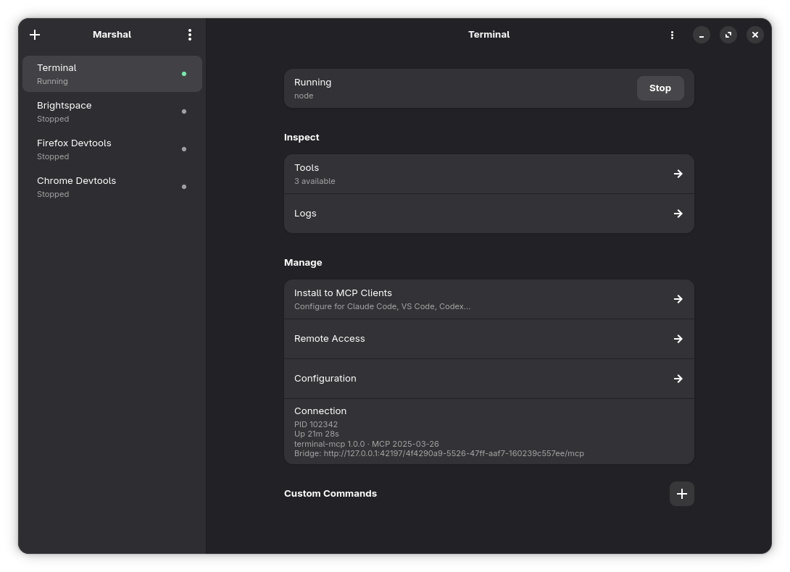

# Marshal

Marshal is a program for the GNOME desktop. Marshal controls servers that use the Model Context Protocol (MCP).



## Function

Marshal can do these tasks:

- Start and stop MCP servers.
- Show the tools and the logs of a server.
- Install the server configuration in client programs.
- Give remote access with OpenAI or ngrok.

## Start Marshal

The computer must have GTK 4.16 or a subsequent version, and libadwaita 1.7 or a subsequent version.

```sh
cargo run
```

## Flatpak

Marshal can be built and installed as a Flatpak from this repository. The sandbox starts MCP servers, tunnel clients, and agent CLIs on the host, and it reads client configuration files in the home directory.

```sh
flatpak install --user flathub org.gnome.Platform//50 org.gnome.Sdk//50 \
  org.freedesktop.Sdk.Extension.rust-stable//25.08
./flatpak/update-cargo-sources.sh
flatpak-builder --user --install --force-clean builddir \
  flatpak/io.github.marshal.Marshal.yml
flatpak run io.github.marshal.Marshal
```

If a native Marshal process is already running, GTK will activate that window instead of opening a second copy. Quit the native build first when you want to test the Flatpak.

## License

GNU General Public License, version 3.0 or a subsequent version. See [LICENSE](LICENSE).
